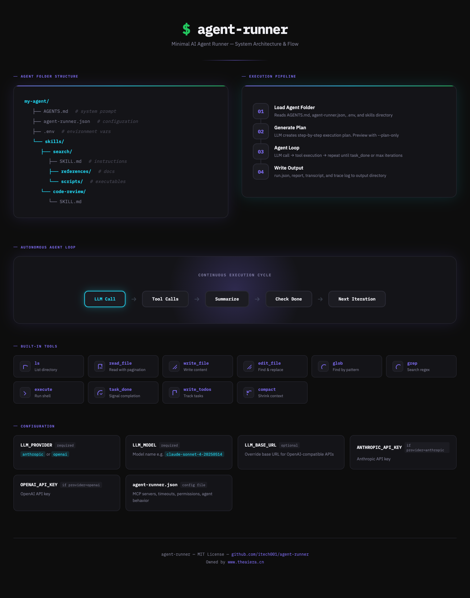

# agent-runner

English | [中文](README-zh.md)

**Lightweight, general-purpose, non-interactive — one Rust binary, zero runtime dependencies, an agent defined entirely by a folder.**

A minimal AI agent runner for your server or container. Give it a folder with `AGENTS.md` and skills, plus a prompt: it plans, uses tools, MCP servers, and skills, iterates autonomously until the task is done, writes its output, and exits. No TUI, no chat session, no runtime to install — you define an agent without writing any code.



## Quick Start

```sh
cd agent-runner
cargo build --release
cp .env.example .env   # edit with your API key

./target/release/agent-runner --agent-dir ./my-agent --prompt "Refactor the auth module"
```

### Docker

```sh
cd agent-runner
docker build -t agent-runner .
docker run --env-file .env agent-runner \
  --agent-dir /agents/my-agent --prompt "Fix the tests"
```

## Why agent-runner

Three properties define it, and everything else follows from them:

**Lightweight.** A single ~3 MB Rust binary with zero runtime dependencies. No Node.js, no Python, no package manager, no daemon. It starts in milliseconds and you can copy it into any container — the binary *is* the whole runtime.

**General-purpose.** It is not a coding assistant specifically. The agent folder is the configuration surface, so the same binary runs a code-refactoring agent, a document-processing agent, a data-migration agent, or a research-summarizing agent — each just a folder with a different `AGENTS.md`, skills, and MCP servers. You build domain agents without writing any source code.

**Non-interactive.** There is no REPL and no chat window. You hand it a prompt, it plans, acts, and exits with a status code. That makes it something you can wire into cron, a CI step, a queue consumer, a webhook handler, or a Kubernetes Job — anywhere a human is not watching and cannot answer "may I?".

## Use Cases

**Scheduled maintenance.** Run a nightly job that updates dependencies, checks licenses, or reconciles docs against code. `agent-runner` runs unattended with `--run-limit` as a hard ceiling, and exits non-zero if it fails, so your scheduler can alert on it.

**CI/CD pipelines.** Add an agent step that fixes lint errors, updates changelogs, migrates API call sites, or generates release notes — before the pipeline gates run. Exit codes (`0` completed, `1` failed, `2` limit exceeded, `3` config error) map directly onto CI semantics.

**Headless batch work over many inputs.** Loop the binary over a directory of inputs: summarize 500 PDFs, classify 10,000 support tickets, translate a doc set, generate tests per module. Each invocation is isolated, so a failure on item 47 does not poison the rest, and all runs write the same structured output.

**Custom domain agents.** Wrap a team's internal knowledge in an agent folder: an SRE agent with runbooks and a shell tool, a support agent with policy references, a data agent with warehouse MCP servers. The folder is versionable, reviewable, and shippable to production as one deployable unit.

**Guarded automation on a server.** Because writes are denied unless a path is in `writable_paths`, you can run an autonomous agent on a live box with a narrow, auditable blast radius: it can read everything it needs to understand the system, but it can only write where you allow.

**Embedded / air-gapped.** Drop the static binary into an offline environment or another team's image. No runtime install and no package registry means nothing to fetch at deploy time.

## Agent = agent-runner + Folder

Everything an agent needs lives in one folder:

```
my-agent/
├── AGENTS.md              # System prompt — who the agent is and how it behaves
├── agent-runner.json      # MCP config, timeouts, permissions
└── skills/                # Optional: extra skills
    └── search/
        ├── SKILL.md       # Skill instructions injected into the system prompt
        ├── references/    # Reference documents for the skill
        └── scripts/       # Executable scripts (exposed as agent tools)
```

That's it. No database, no server, no setup beyond the folder.

## agent-runner.json

MCP servers, timeouts, permissions, and agent behavior. LLM settings come from environment variables or `.env`:

```json
{
  "mcp_servers": {},
  "timeouts": {
    "tool_timeout_secs": 120,
    "run_limit_secs": 3600
  },
  "agent": {
    "max_iterations": 50,
    "plan_required": true,
    "execute_enabled": false
  },
  "writable_paths": ["./src/*", "/tmp/out/*"],
  "permissions": []
}
```

By default all paths are **read-only**. Only paths listed in `writable_paths` can be written to (by `write_file`, `edit_file`, `execute`). Patterns use glob syntax (`**`, `*`, `?`). The `permissions` array is kept for advanced allow/deny rules and is checked as a fallback when `writable_paths` does not match.

### Timeout Settings

Timeouts can be set in `agent-runner.json` and overridden by CLI flags:

| Setting | Config Key | CLI Flag | Default |
|---------|-----------|----------|---------|
| Per-tool timeout | `timeouts.tool_timeout_secs` | `--tool-timeout` | 120s |
| Whole run limit | `timeouts.run_limit_secs` | `--run-limit` | 3600s |

### MCP Servers

```json
{
  "mcp_servers": {
    "filesystem": {
      "command": "npx",
      "args": ["-y", "@modelcontextprotocol/server-filesystem", "/data"],
      "env": {}
    }
  }
}
```

### Environment Variables

Set LLM provider, model, and API key via environment variables or a `.env` file:

```
LLM_PROVIDER=anthropic
LLM_MODEL=claude-sonnet-4-20250514
LLM_BASE_URL=https://api.anthropic.com
ANTHROPIC_API_KEY=sk-ant-...
```

| Variable | Required | Description |
|----------|----------|-------------|
| `LLM_PROVIDER` | yes | `anthropic` or `openai` |
| `LLM_MODEL` | yes | Model name (e.g. `claude-sonnet-4-20250514`, `gpt-4o`) |
| `LLM_BASE_URL` | no | Override base URL for OpenAI-compatible APIs |
| `LLM_API_KEY` | yes | API key (or use provider-specific name below) |
| `ANTHROPIC_API_KEY` | if provider=anthropic | Anthropic API key |
| `OPENAI_API_KEY` | if provider=openai | OpenAI API key |

### API Keys

API keys can be provided via:

- **`.env` file** — place in the working directory (loaded automatically)
- **Environment variables** — `export ANTHROPIC_API_KEY=sk-ant-...`

### Full Configuration Reference

```json
{
  "mcp_servers": {},
  "timeouts": {
    "tool_timeout_secs": 120,
    "run_limit_secs": 3600
  },
  "agent": {
    "max_iterations": 50,
    "plan_required": true,
    "tool_output_token_limit": 20000,
    "user_message_token_limit": 50000,
    "execute_timeout_secs": 3600,
    "execute_enabled": false
  },
  "summarization": {
    "enabled": true,
    "trigger_tokens": 80000,
    "keep_tokens": 20000,
    "trim_tokens": 4000
  },
  "writable_paths": ["./src/*"],
  "permissions": [
    {
      "operations": ["write"],
      "paths": ["./*"],
      "mode": "allow"
    }
  ],
  "subagents": []
}
```

## CLI

```
agent-runner --agent-dir <DIR> --prompt <TEXT|FILE> [OPTIONS]
```

| Option | Default | Description |
|--------|---------|-------------|
| `--agent-dir` | (required) | Path to agent folder |
| `--prompt` | (required) | Task prompt or path to a text file |
| `--plan-only` | `false` | Generate plan (`plan.json`) and exit without executing |
| `--max-iterations` | `50` | Maximum agent loop iterations |
| `--output-dir` | `./agent-output` | Output directory for reports and traces |
| `--working-dir` | `.` | Working directory for filesystem/execute tools |
| `--writable-paths` | (from config) | Comma-separated glob patterns of writable paths (e.g. `./src/*,/tmp/*`) |
| `--tool-timeout` | `120` | Timeout in seconds for each tool call |
| `--run-limit` | `3600` | Maximum total run time in seconds |
| `--verbose` | `false` | Print iteration details to stderr |
| `--sandbox` | `false` | Enable shell execution regardless of config |

### Exit Codes

| Code | Meaning |
|------|---------|
| `0` | Task completed |
| `1` | Task failed |
| `2` | Max iterations or run limit exceeded |
| `3` | Configuration error |

## Built-in Tools

The agent has these tools available by default:

| Tool | Description |
|------|-------------|
| `ls` | List directory entries |
| `read_file` | Read file contents with line-based pagination |
| `write_file` | Write content to a file (creates parent dirs) |
| `edit_file` | Find-and-replace strings in a file |
| `glob` | Find files matching a glob pattern (respects `.gitignore`) |
| `grep` | Search file contents with regex (respects `.gitignore`) |
| `execute` | Run a shell command (when enabled) |
| `read_plan` | Read the structured execution plan (`plan.json`) |
| `update_plan` | Update a plan step's status (`pending`/`in_progress`/`done`/`skipped`) |
| `task_done` | Signal task completion |
| `write_todos` | Update internal todo list |
| `compact_conversation` | Trigger conversation compaction |

### Execution Plan

When `plan_required` is `true` (the default), the agent first generates a structured execution plan saved as `plan.json`:

```json
{
  "task": "Refactor the auth module",
  "created_at": "2026-08-10T12:00:00Z",
  "steps": [
    { "id": 1, "description": "Read the auth module", "status": "done" },
    { "id": 2, "description": "Write tests", "status": "in_progress" },
    { "id": 3, "description": "Run tests", "status": "pending" }
  ]
}
```

During execution the agent reviews the plan and step statuses with `read_plan`, and marks progress with `update_plan`, so `plan.json` always reflects the latest state of the run.

### Permissions

By default **all paths are read-only** — `ls`, `read_file`, `glob`, and `grep` work everywhere. Write operations (`write_file`, `edit_file`, `execute`) are only allowed on paths matching `writable_paths`:

```json
{
  "writable_paths": ["./src/*", "./tests/*", "/tmp/out/*"]
}
```

Patterns use glob syntax (`**` for recursive, `*` for single-level, `?` for one char). For advanced allow/deny rules, the legacy `permissions` array is still supported as a fallback:

```json
{
  "writable_paths": ["./src/*"],
  "permissions": [
    { "operations": ["write"], "paths": ["./secrets/*"], "mode": "deny" }
  ]
}
```

`writable_paths` can also be set via the `--writable-paths` CLI flag (comma-separated); CLI values are added on top of config values.

## Output

After execution, the output directory contains:

| File | Description |
|------|-------------|
| `run.json` | Detailed run log with per-iteration and per-tool TAT, errors, and exceptions |
| `plan.json` | Structured execution plan (steps with status, readable/writable by the agent) |
| `report.json` | Status, token usage, iterations, duration, todos |
| `transcript.json` | Full message history |
| `trace.jsonl` | Structured event log (one JSON object per line) |

### run.json

Every run produces a `run.json` with full debugging details:

```json
{
  "status": "completed",
  "exit_code": 0,
  "started_at": "2026-05-26T12:00:00.000Z",
  "finished_at": "2026-05-26T12:01:23.456Z",
  "duration_ms": 83456,
  "iterations": [
    {
      "iteration": 1,
      "llm_tat_ms": 3200,
      "llm_input_tokens": 1200,
      "llm_output_tokens": 340,
      "tool_calls": [
        {
          "tool": "read_file",
          "arguments": {"file_path": "src/main.rs"},
          "tat_ms": 12,
          "is_error": false,
          "timed_out": false
        }
      ]
    }
  ],
  "errors": []
}
```

## How It Compares

These tools all run an LLM agent loop, but they are built for different moments of work. The difference is not which is "better" — it is whether a human is in the loop, and whether the agent exists for a session or for a task.

| | agent-runner | Claude Code | Codex CLI | OpenClaw | Hermes Agent |
|---|---|---|---|---|---|
| **Interaction model** | Non-interactive, run-to-completion | Interactive TUI (plus `-p` headless mode) | Interactive TUI (plus `codex exec`) | Always-on daemon, chat-driven | Interactive TUI + gateway daemon |
| **Runtime** | Rust, single static binary | Native binary / npm (Node ≥ 22) | Rust (`codex-rs`) | TypeScript / Node.js | Python |
| **Lifetime** | One task, then exits | A working session | A working session | Runs forever | Runs forever |
| **Primary lens** | Automation & pipelines | Developer at a terminal | Developer at a terminal / cloud delegation | Personal assistant | Personal/gateway assistant + research |
| **Definition of an agent** | A folder (`AGENTS.md` + skills + MCP) | Repo context + CLAUDE.md | Repo context + AGENTS.md | Out-of-the-box assistant, configured in chat | Skills/memory that accrete over time |
| **Sandboxing posture** | Read-only by default; writes only in `writable_paths` | Permission prompts by default | Approval modes / sandbox flags | Runs with the user's own device access | Runs on a VPS/container you provide |

### The short version

**agent-runner vs. Claude Code and Codex CLI.** Claude Code and Codex CLI are interactive products for a developer sitting at a terminal: you steer, they respond, and the session is the unit of work. Both do offer headless modes (`claude -p`, `codex exec`), but those are secondary entry points into an interactive tool. agent-runner inverts the priority — the batch invocation is the *only* mode. If you were going to run `claude -p` inside a cron job, you are exactly the target user; if you want a collaborator for an afternoon of refactoring, you want Claude Code or Codex instead.

**agent-runner vs. OpenClaw.** OpenClaw is an always-on personal assistant: one gateway process that lives on your hardware and talks to you through WhatsApp, Telegram, Slack, and 20+ other surfaces. It is conversational, persistent, and stateful — you message it, it remembers. agent-runner has no message surface, no memory between runs, and no daemon. They are complementary rather than competing: OpenClaw answers *"assistant, handle this while I chat with you"*; agent-runner answers *"run this task now, unattended, and exit."*

**agent-runner vs. Hermes Agent.** Hermes Agent (Nous Research) is a Python agent that combines an interactive TUI with a messaging gateway, cron automations, subagents, and self-improving memory. Like OpenClaw, it is built to be a long-lived companion that grows with you. agent-runner has no memory and no growth story by design: each run is a clean, reproducible task with a folder-defined identity and a deterministic exit code.

**Where agent-runner is the right tool:** unattended execution on a server, in CI, or in a container; batch processing over many inputs; shipping a domain-specific agent as one versionable folder; and any workload where "no human available to answer a permission prompt" is a requirement rather than a limitation.

**Where it is the wrong tool:** pair-programming, exploratory work, anything where you want to redirect the agent mid-flight, and anything requiring conversational memory across runs.

### Footprint

| | agent-runner | Claude Code | Codex CLI | OpenClaw | Hermes Agent |
|---|---|---|---|---|---|
| Install | Copy one binary | Installer / npm | npm / brew / prebuilt | npm (Node 24+) | pip / git checkout |
| Runtime deps | None | Node.js (npm path) | None (Rust binary) | Node.js | Python |
| Approx. binary size | ~3 MB | ~80 MB (community estimate) | ~65–100 MB archive | ~389 MB unpacked (npm) | Python package |
| Cost model | Your API key, pay per token | Subscription or API | Subscription or API | Free (MIT), bring your own model access | Free (MIT), bring your own model access |

Sizes and install footprints are approximate and change frequently — verify against each project's current release before quoting them. agent-runner's own numbers assume an optimized `cargo build --release`.

## How It Works

1. Loads the agent folder (AGENTS.md, agent-runner.json, skills) — from `--agent-dir` only, never from your home directory
2. Generates a structured execution plan (`plan.json`) when `plan_required` is true; the agent tracks progress with `read_plan` / `update_plan`
3. Runs an autonomous loop: LLM call → permission check → tool execution → repeat
4. Summarizes conversation history when context gets long
5. Exits when the agent calls `task_done` or hits max iterations / run limit
6. Writes run.json, plan.json, report, transcript, and trace log to the output directory

## License

MIT
